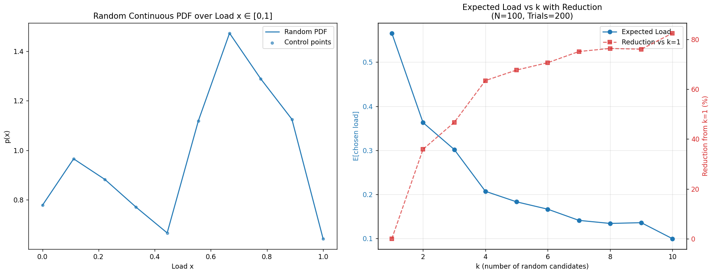
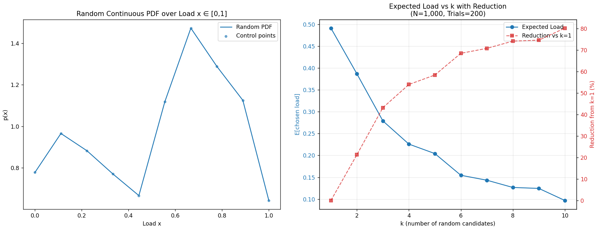
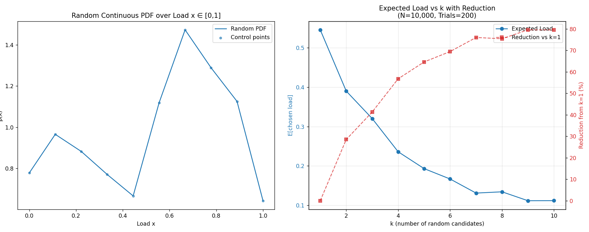

# Randomized Load Balancing

## Problem Statement

In distributed systems with thousands or millions of servers, how can we efficiently assign incoming requests to servers while achieving near-optimal load balancing?

**The Challenge**: Traditional approaches require either:
- **Global state tracking**: Maintaining and querying the load of all servers (expensive and slow for large systems)
- **Centralized coordination**: A single coordinator that becomes a bottleneck
- **Complex protocols**: Distributed consensus algorithms that add significant overhead

**The Surprising Solution**: By randomly sampling just a **small constant number (k)** of servers and choosing the least loaded among them, we can approximate optimal load balancing with minimal overhead.

### Why This Is Remarkable

- **Scalability**: Whether you have 100 or 100,000 servers, sampling k=2 or k=5 servers is sufficient
- **No global state**: No need to track or communicate with all servers
- **Simple implementation**: Just random sampling + minimum selection
- **Near-optimal performance**: Achieves load balancing close to what you'd get by checking all servers

This project demonstrates through Monte Carlo simulations that **randomly picking a very few servers can approximate optimal load balancing**, making it practical for large-scale distributed systems.

---

## Key Definitions

### Server Load

**Server Load** represents the current workload or utilization of a server, normalized to a value between 0 and 1:

- **0**: Server is completely idle (no load)
- **1**: Server is at maximum capacity (fully loaded)

In these simulations, each server's load is sampled from a probability distribution over the interval [0, 1].

### Load Distribution

**Load Distribution** is the probability density function (PDF) that describes how server loads are distributed across all servers in the system:

- **Uniform Distribution**: All load values between 0 and 1 are equally likely
- **Non-uniform Distribution**: Some load values are more likely than others (e.g., more servers tend to be lightly loaded or heavily loaded)
- The distribution captures real-world scenarios where servers may have varying workloads due to different factors

### Number of Servers (N)

**N** represents the total number of servers available in the distributed system. In these simulations, typical values range from 1,000 to 100,000 servers. The remarkable property of randomized load balancing is that the algorithm's effectiveness scales independently of N.

### Sampling Parameter (k)

**k** is the number of servers randomly sampled when a new request arrives:

- The algorithm picks k random servers from the pool of N servers
- It evaluates the load of each sampled server
- The request is assigned to the server with the **minimum load** among the k sampled servers
- Higher k values lead to better load balancing but require more sampling overhead

### Expected Load

**Expected Load** is the average load of the server chosen by the algorithm, measured over many trials (Monte Carlo simulation). It represents the typical workload that will be assigned to a server when using a given sampling strategy (k value). Lower expected load indicates better load balancing performance.

### Number of Trials (T)

**T** is the number of Monte Carlo simulation trials used to estimate the expected load. Each trial simulates:

1. Generating N server loads from the distribution
2. Running the randomized load balancing algorithm for each k value
3. Recording the chosen server's load

The results are averaged over all T trials to compute the expected load.

---

## The Problem

In distributed systems, when new incoming requests arrive, they need to be assigned to servers. The goal is to put each new request on the server with the least load to optimize overall system usage and distribute the workload evenly. This is crucial because:

- **Avoiding bottlenecks**: If we keep filling only one server while keeping others empty, the heavily loaded server becomes a bottleneck
- **Resource utilization**: Other servers remain idle, wasting computational resources
- **System efficiency**: Work will be fetched and processed later, so balanced distribution ensures smooth operation

## The Power of Random Sampling

The beauty of randomized load balancing lies in its simplicity and effectiveness. Instead of maintaining global state about all servers or using complex coordination protocols, we achieve excellent load distribution through simple random sampling.

### How It Works

When a new request arrives:

1. Randomly sample **k** servers from the pool of N total servers
2. Check the current load of each of these k servers
3. Assign the request to the server with the **minimum load** among the k sampled servers

This simple algorithm provides remarkably good load balancing with minimal overhead.

### Key Results

> **Note on Results Variability**: The specific expected load values (e.g., ~50%, ~33%, ~25%) can vary depending on the load distribution across servers. For simplicity, the results presented here are based on the `wiggly_server_load.py` script's random smooth distribution.
>
> In real-life scenarios with well-functioning load balancing systems, servers tend to have **nearly identical loads** because:
>
> - Server handling capacity is typically very large relative to individual requests
> - A newly added request does not significantly change the server's current load
> - The algorithm works effectively over time to keep loads balanced across all servers
>
> This near-uniform load state makes the system more predictable and the benefits of randomized load balancing even more pronounced.

- **k = 1 (Random selection)**: Picking one server randomly and assigning the request results in an **expected load of ~50%**

  - This is equivalent to pure random assignment with no load awareness
  - The expected load is the midpoint of the [0, 1] interval for uniform distribution
- **k = 2 (Power of Two Choices)**: Picking 2 random servers and choosing the one with lower load reduces expected load to approximately ~**30%**

  - Achieved with only one additional server query
- **k = 3+**: Further increases in k continue to reduce expected load, but with diminishing returns. With respect to k=1

  - k=3 typically achieves ~40% reduction
  - k=5 approaches ~64% expected load
  - Beyond k=10, improvements become marginal

### Why This Matters: The Tradeoff Analysis

Each additional sample (higher k) provides:

- **Benefit**: Lower expected load on chosen servers, better load distribution
- **Cost**: Additional server queries, increased latency, more computational overhead

The **power of two choices** (k=2) is particularly significant because:

- It provides massive improvement over random selection (k=1)
- It requires only **one additional query** compared to random assignment
- The cost-benefit ratio is optimal for most real-world systems
- Going from k=2 to k=3 provides less relative improvement than going from k=1 to k=2

### The Remarkable Property

**No matter how many servers you have in your system** (100, 1,000, or 100,000 servers), picking just a few servers randomly (typically k = 2 to 10) can achieve highly optimized load balancing. This scales incredibly well and avoids the overhead of tracking the global state of all servers.

This is known as the **"Power of Two Random Choices"** phenomenon in distributed systems, which shows that sampling just two random options and picking the better one dramatically improves load distribution compared to purely random assignment.

## Experimental Results

### Wiggly Server Load Distribution

Below are experimental results showing how the expected chosen load decreases as k (number of randomly sampled servers) increases, tested across different numbers of servers with the same k values and random seeds.







---

## Scripts Overview

This repository contains three simulation scripts that demonstrate randomized load balancing under different server load distributions:

### 1. `uniform_load_server.py` - Uniform Load Distribution

Simulates the classic scenario where server loads are uniformly distributed between 0 and 1.

**Changeable Parameters:**

- `num_servers`: Number of servers in the system (default: 10,000)
- `max_k`: Maximum number of servers to sample (default: 5% of num_servers)
- `num_trials`: Number of Monte Carlo simulation trials (default: 100)

**Use Case:** Baseline analysis and understanding the fundamental behavior of randomized load balancing.

---

### 2. `polynomial_server_load.py` - Polynomial Load Distribution

Simulates non-uniform load distributions using polynomial probability density functions (PDFs). Server loads are sampled from a customizable polynomial distribution over [0,1].

**Changeable Parameters:**

- `num_servers`: Number of servers in the system (default: 10,000)
- `max_k`: Maximum number of servers to sample (default: 10)
- `num_trials`: Number of Monte Carlo simulation trials (default: 100)
- `poly_coeffs`: Polynomial coefficients defining the load distribution (default: `[0.02, 0.15, 1]`)
  - Example: `[0.02, 0.15, 1]` represents p(x) = 0.02x² + 0.15x + 1
  - The polynomial is automatically normalized to form a proper PDF

**Use Case:** Testing scenarios where server loads follow predictable non-uniform patterns (e.g., more servers tend to be heavily loaded or lightly loaded).

---

### 3. `wiggly_server_load.py` - Random Smooth Load Distribution

Generates a random, smooth, continuous PDF over [0,1] to represent unpredictable, complex load distributions. Uses control points with smoothing and rejection sampling.

**Changeable Parameters:**

- `num_servers`: Number of servers in the system (default: 10,000)
- `max_k`: Maximum number of servers to sample (default: 20)
- `num_trials`: Number of Monte Carlo simulation trials (default: 200)
- Random seed (optional): Set `random.seed()` and `np.random.seed()` for reproducibility

**Use Case:** Exploring load balancing behavior under realistic, complex, and unpredictable load distributions. The script also visualizes both the random PDF and the resulting load balancing performance in a single figure.

---

## Running the Simulations

Each script can be run independently:

```bash
python uniform_load_server.py
python polynomial_server_load.py
python wiggly_server_load.py
```

All scripts generate plots showing the relationship between k (number of sampled servers) and the expected chosen load, demonstrating the effectiveness of randomized load balancing.

## Requirements

```
matplotlib
numpy (for wiggly_server_load.py)
```

Install with:

```bash
pip install matplotlib numpy
```
